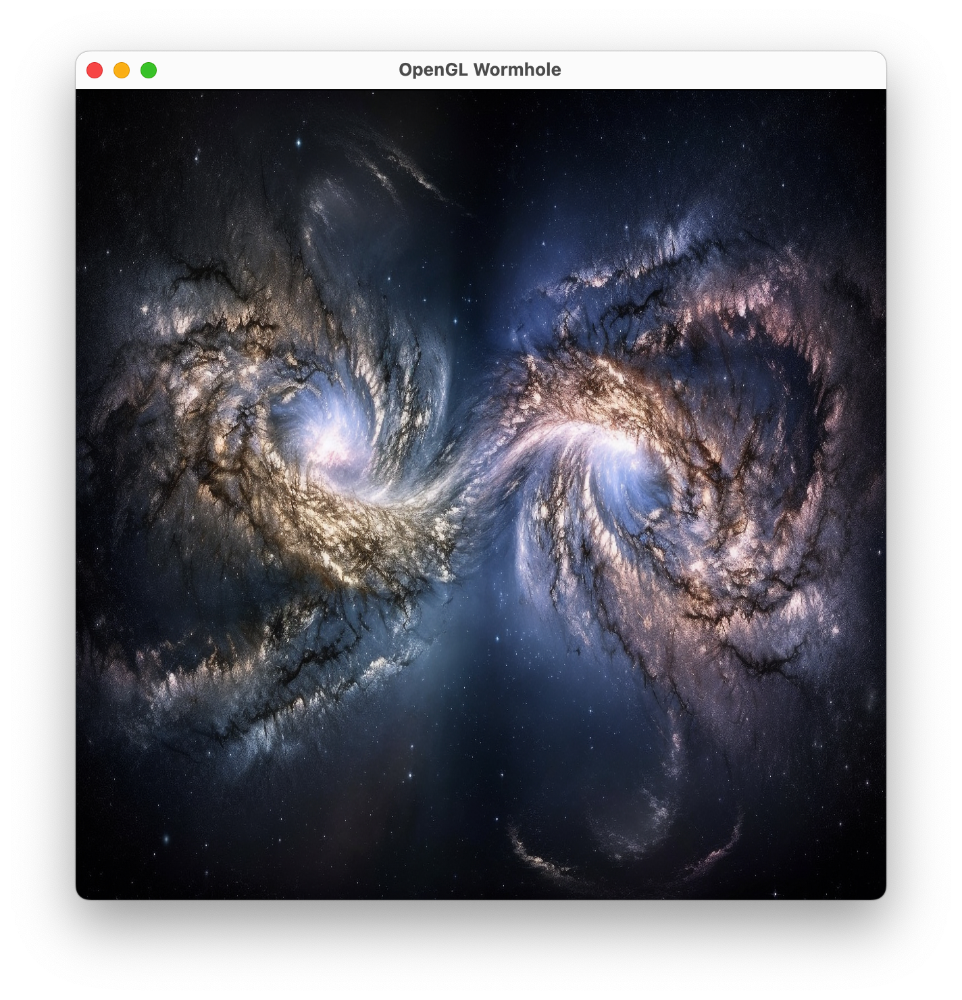
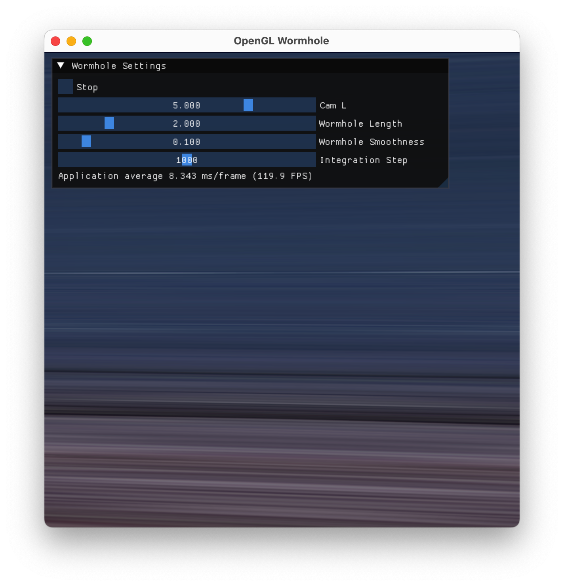

# CENG469 - TERM PROJECT
Contributors: Cafer Selli, Elif Ecem Ümütlü

Hi everyone, we are excited to share our term project for Computer Graphics II course at Middle East Technical University in this blog post. The project is about wormhole implementation based on the paper named "Visualizing Interstellar's Wormhole". (link can be found [here](https://www.researchgate.net/publication/272195706_Visualizing_Interstellar's_Wormhole)). The purpose of the project is to replicate the behaviour of the wormhole to create a wormhole-like effect on the surfaces, spaces.

## Project Overview
There are several aspects of the project:
- Use equilateral image to replicate a never-ending space
- Shader implementation of the wormhole
- Allow user interaction through mouse and keyboard input as well as through wormhole settings UI

## Equilateral Image
In order to create an infinite space like feeling, a skybox needs to be implemented. This skybox can be created using cubemaps defined in OpenGL. However, using such cubemaps is excessive since this skybox will be dynamically changed according to the ray direction. Therefore, we decided to use an equilateral image to create a never-ending space. Here is the two equilateral images we used in our project:

<table>
    <tr>
        <td>  <div style="text-align: center"> Equilateral Image for the skybox of Universe #1 </div></td>
        <td> <div style="text-align: center"> Equilateral Image for the skybox of Universe #2 </div> </td>
    </tr>
</table>

Also there are some extra skybox that is used in paper, later on the blogpost we will also demonstrate how these two skybox also used.

<table>
    <tr>
        <td>  <div style="text-align: center"> Equilateral Image for the skybox of Universe #1 from paper </div></td>
        <td> <div style="text-align: center"> Equilateral Image for the skybox of Universe #2 from paper </div> </td>
    </tr>
</table>

## Shader Implementation of the Wormhole
The core of our project lies in the shader implementation. The fragment shader is responsible for rendering the wormhole effect by manipulating texture coordinates and applying complex mathematical transformations.

In order to have a such wormhole effect, trajectory of each beam of light needs to be calculated. This is not so possible using a simple camera and scene setup. Therefore, we need to calculate the ray direction in the fragment shader. To calculate the ray and its trajectory first we have to setup a ray tracing shader.

### Ray Direction Calculation

The ray direction calculation is based on a Youtube video from "Sebastian Lague" named "Coding Adventure: Ray Tracing". The video can be found [here](https://www.youtube.com/watch?v=Qz0KTGYJtUk). 

In order to create a ray tracer, first we have to show a quad on screen to represent the screen. Then, we have to calculate the ray direction for each pixel on the screen. 

```cpp
    // Set up vertex data and buffers and configure vertex attributes
    float vertices[] = {
    // positions          // texture coords
    -1.0f,  1.0f, 0.0f,  0.0f, 1.0f,
    -1.0f, -1.0f, 0.0f,  0.0f, 0.0f,
    1.0f, -1.0f, 0.0f,  1.0f, 0.0f,
    1.0f,  1.0f, 0.0f,  1.0f, 1.0f
    };
    unsigned int indices[] = {
    0, 1, 2,
    2, 3, 0
    };
```

First we create the quad by assigning the position of its vertices and indices of each vertex for triangles on quad. After standard procedure of creating VAO, VBO and EBO for the quad and rendering on screen, we can start calculating our rays!


```glsl Vertex Shader
#version 330 core
layout(location = 0) in vec3 position;
layout(location = 1) in vec2 texCoords;

out vec2 TexCoords;

void main()
{
    gl_Position = vec4(position, 1.0);
    TexCoords = texCoords;
}
```

Here is the vertex shader for the quad. It is a simple vertex shader that takes the position and texture coordinates of the vertices and passes the texture coordinates to the fragment shader.

```glsl Fragment Shader
    // ray projection
    vec2 uv = TexCoords - 0.5;
    vec3 viewPointLocal = vec3(uv, 1.0) * uViewParams;
    vec3 viewPointWorld = (uCamLocalToWorldMatrix * vec4(viewPointLocal, 1.0)).xyz;

    // vec3 vel = normalize(vec3(-zoom, uv));
    vec3 vel = normalize(viewPointWorld);
```

In the fragment shader, we calculate the ray direction by taking the texture coordinates of the pixel and converting them to world coordinates. Then, we normalize the vector to get the ray direction. This ray direction will be used to calculate the wormhole effect.

### Wormhole Math & Physics

In order to create our wormhole, we need to connect two 3D spaces using an extra dimension. There are several ways to create a mathematical model for a wormhole. In the paper first mentioned wormhole equation is the _Ellis Wormhole_ equation. The equation is as follows:

$$ 
ds^2 = -dt^2 + dl^2 + r^2(d\theta^2 + sin^2\theta d\phi^2)
$$
where $r$ is a function of $l$
$$
r(l) = \sqrt{\rho^2 + l^2}
$$

$t$: physical time of a observer standing at a point

$\{l,\theta,\phi\}$: Position of the observer in 3D

$\rho$: throat radius

$s$: Schwarzchild coordinates $\{t,l,\theta,\phi\}$

This formulation of a wormhole is not suitable for our project since it does not consider any parameters about the wormhole such as its length, smoothness, etc. Therefore, we need to create a new mathematical model for the wormhole.

The paper suggests a mathematical model named _Double Negative Three-Parameter Wormhole_. This model 3 variants. Each of them considers a different property of the wormhole. These are:

- Variant 1: Length and Radius of the wormhole with sharp transition
- Variant 2: Lensing length with smooth transition.
- Variant 3: Gravitational pull of wormhole.

### Variant 1: Length and Radius of the wormhole with sharp transition
<table>
    <tr>
        <td>  </td>
        <td>  </td>
    </tr>
</table>

In the first variant, the wormhole is considered as a cylinder with two spheres at the ends. The cylinder has a length of $2a$ and the spheres have a radius of $\rho$. The wormhole is defined as follows:


However, this yield into a wormhole with a very sharp edges, we need to smooth it out by using some _gravity_. We will use some equations that is used by gravitational lensing calculations ( but they will actually called spatial lensing in case of wormholes, because wormholes are assumed to have no mass).

### Variant 2: Lensing length with smooth transition

In order to have a cool and smooth wormhole we can use _Schwarzschild metric_, which is the _exact_ solution to _Einstein field equations_ that describe the gravitational field outside a spherical mass under assumption of zero electrical charge and zero angular momentum.

It can be formulated as

$$
ds^2 = -(1 - \frac{r_s}{r})dt^2 + (1 - \frac{r_s}{r})^{-1}dr^2 + r^2(d\theta^2 + sin^2\theta d\phi^2)
$$

$r_s$ is the _Schwarzschild radius_ of the massive body, a scale factor which is related to its mass $M$ by $r_s = 2GM/c^2$ where $G$ is the gravitational constant. For simplicity sake we can assume that $r_s = 2M$.

Using the general wormhole metric we can see that see that

$$
dl = \pm dr/\sqrt{1-2M/r}
$$

However, we can see that, integrating this function will yield with a function that depends on $r$ and return $l$. But we want the opposite. Instead we can use this analytic function that is _roughly the same_ as the Schwarzschild $r(l)$:

$$
\begin{align}
r &= \rho + \frac{2}{\pi}\int^{|l| - a}_{0}arctan(\frac{2\xi}{\pi M})d\xi\\
&= \rho + M\left[x\text{ arctan }x - \frac{1}{2}ln(1+x^2)\right] \text{ for } |l| > a
\end{align}
$$

where

$$
x = \frac{2(|l| - a)}{\pi M}
$$

 


This is our wormhole function $r(l)$. We will use this and some other functions to iteratively calculate the ray direction in the fragment shader.

As indicated in the paper, to catch a realistic wormhole effect, there should be gravitational lensing (distortions) close to the intersections. Consequently, the smooth transitions are necessary. The below image depicts the wormhole with and without distortions. The desired look is the second one.

 

### Variant 3: Gravitational pull of wormhole

In the third variant, the wormhole is considered as an object with spatial lensing but no mass. In order to achieve the effect of distortion we dont need to calculate real gravitational effect of it, since coverage of this paper does not include general relativity. Instead, we can use some simple functions to create a similar effect.

### Final Variant

In our implementation, we used the second variant of the wormhole. We used the following functions to calculate the wormhole effect:


$$
\begin{align}
\frac{dl}{dt} &= p_l, &(1)\\
\frac{d\theta}{dt} &= \frac{p_{\theta}}{r^2},&(2)\\
\frac{d\phi}{dt} &= \frac{b}{r^2sin^2\theta},&(3)\\
\frac{dp_l}{dt} &= B^2\frac{dr/dl}{r^3},&(4)\\
\frac{dp_{\theta}}{dt} &= \frac{b^2}{r^2}\frac{cos\theta}{sin^3\theta}&(5)
\end{align}
$$

These are the five equations for the five quantities { $l$ , $\theta$ , $\phi$ , $p_l$ , $p_{theta}$ } as the function of the $t$ along the geodesic (ray). There are also two more functions for the $b$ and $B$, which are the momentum constants of the ray. These can be calculated as:

$$
\begin{align}
b &= p_{\theta} = r\text{ sin }\theta n_{\hat{\phi}}\\
B &= r^2(n_{\hat{\theta}}^2 + n_{\hat{\phi}}^2)
\end{align}
$$


These functions are might seem a bit complex. To be honest, they are complex. Lets just go over parameters and functions one by one to understand what each of them are responsible for.

- $p_l$ , $p_\theta$ , $p_{\phi}$ : These parameters are the canonical momenta of the incoming ray. Which can be explained as the momentum of the light ray in the polar coordinates. 
- $n_\hat{\theta}$ , $n_\hat{\phi}$ : These are parameters for where is the light is coming from. In our implementation in order to keep calculations simple, we assumed that the wormhole is located in +X direction and rays coming from there.

- Equation 1: This is the derivative of the parameter $l$. This function is going to be used to determine how the $l$ is changing according to the momenta of the lightray.
- Equation 2: This is the derivative of the spatial parameter $\theta$. This one is not going to be used since we are assuming the wormhole is located at the +X direction, $\theta$ will be equal to 0 and $sin0 = 0$.
- Equation 3: This is the derivative of the second spatial parameter $\phi$. This equation will be used to determine the direction of the ray and determining where it is land according to the skybox.
- Equation 4: This is the derivative of the momentum of the light in $l$ direction. Since this equation and 1st equation is tight closely together, we will combine these to into one.
- Equation 5: This equation is the derivative of the momentum of the light in spatial parameter $\theta$. This equation is also not used in our implementation, since $tan^30 = 0$.

So, since we get this heavy physics and math out of the way lets start implementing our wormhole.

## Wormhole Shader Implementation

First we start by defining the $r(l)$ and its derivative as functions. 

```glsl
// wormhole function r(l)
float LtoR(float l) {
    float x = max(0.0, 2.0 * (abs(l) - a) / PI / M);
    return 1.0 + M * (x * atan(x) - 0.5 * log(1.0 + x * x));
}
```

```glsl
// wormhole derivative of r(l)
float LtoDR(float l) {
    float x = max(0.0, 2.0 * (abs(l) - a) / (PI * M));
    return 2.0 * atan(x) * sign(l) / PI;
}
```

After these two main functions, we implemented a simple function to convert direction vector to UV coordinates. This function is used to sample the skybox.

```glsl
vec2 DirToUV(vec3 dir)
{
    vec3 dirNormalized = normalize(dir);
    vec2 uv = vec2((atan(-dirNormalized.z,dirNormalized.x) + 1)/(2*PI), acos(-dirNormalized.y)/PI);
    return uv;
}
```

After these functions, we implemented the main fragment shader. In this fragment shader, we calculate the initial conditions of the differential equations and solve them iteratively.

```glsl
  // ray tracing
  float l = camL;
  float r = LtoR(camL);
  float dl = vel.x;
  float B = r * length(vel.yz);
  float phi = 0.0;
  float dr;
```

After the initial conditions are set, we start solving the differential equations iteratively. We use the Runge-Kutta method to solve the differential equations. The Runge-Kutta method is a numerical method to solve ordinary differential equations. It is a fourth-order method that is used to solve the differential equations in our implementation.

```glsl
int steps = 0;
while (abs(l) < max(abs(camL) * 2.0, a + 2.0) && steps < maxSteps) {
    ...
}
```

In the while loop we check whether the max iteration count is reached or the value of l has surpassed position of the camera or exited the wormhole.

```glsl
...
{
    dr = LtoDR(l);
    r = LtoR(l);
    l += dl * dt;
    phi += B / (r * r) * dt;
    dl += B * B * dr / (r * r * r) * dt;
    steps++;
}
```

In each iteration we calculate the new values of each parameter using the Runge-Kutta method. After the loop is finished, we calculate the direction vector the ray that exited the wormhole

```glsl
    float dx = dl * dr * cos(phi) - B / r * sin(phi);
    float dy = dl * dr * sin(phi) + B / r * cos(phi);
    vec3 vec = normalize(vec3(dx, dy * beta));
    vec3 cubeVec = vec3(-vec.x, vec.z, -vec.y);
```

Using the direction vector, we calculate the UV coordinates of the skybox and sample the corresponding skybox. Plus in order to simulate the scattering of the light in the wormhole, we added a fog effect to the wormhole. This fog effect also helps to create a more realistic wormhole effect and helps to hide some artifacts due to long iterations.


```glsl

// set pixel color
float iteration_fog = 1.0 - smoothstep(0.0, 1.0, float(steps) / float(1000));

if (l < 0.0) {
    FragColor = texture(texture1, DirToUV(cubeVec)) * iteration_fog;
} else {
    FragColor = texture(texture2, DirToUV(cubeVec)) * iteration_fog;
}
```


## User Interaction and Camera Movements

### Controls
- `A`, `D`: Move the camera backward, and forward, respectively. Change camL, the distance of the camera from the center of the wormhole.
- `W`, `S`: Increase and decrease wormhole length, respectively.
- `Q`, `E`:  Decrease and increase wormhole smoothness, respectively.
- `Z`, `X`:  Decrease and increase iteration of differentiation, respectively.
- `ESC`: Close the window
- `Mouse right click`: Look around 

### Wormhole Settings UI


## Controls Explanation
Users can interact with the environment in two ways. They can either use keyboard to apply operations above or they can use wormhole setting interface for a better visual experience.

- In our implementation, at the beginning of the program, camera travels between two universes. User can stop the automatic move of the camera using the stop toggle.
- Camera can be dragged forward and backwards using A and D buttons.
- In each right cursor pressed mouse movement, new orientation of the camera is calculated and camera viewing matrix is updated, correspondingly.
- We implemented wormhole settings UI using imgui library.

## Results

Here is the final result of our project. We have implemented a wormhole effect using the mathematical model of the wormhole. The wormhole effect is applied to the skybox to create a realistic wormhole effect. The wormhole effect is calculated using the Runge-Kutta method in the fragment shader. The wormhole effect is applied to the skybox to create a realistic wormhole effect. The wormhole effect is calculated using the Runge-Kutta method in the fragment shader.

<table>
    <tr>
        <td> <div align="left">
              <a href="https://www.youtube.com/watch?v=6Q_l6Y3uzcY">
                 
              </a>
        </div> <div style="text-align: center">Demo video OpenGL</div> </td>
        <td>  <div align="left">
              <a href="https://www.youtube.com/watch?v=sjjDArBl00A">
                 
              </a>
        </div> <div style="text-align: center"> Demo video Unity</div> </td>
    </tr>
</table>

## Comments on the Project

The project was a great experience for us. We learned a lot about wormholes and how they can be implemented in computer graphics. We also learned a lot about the Runge-Kutta method and how it can be used to solve differential equations in computer graphics.

The biggest struggle for us during the project was to understand what all of the parameters is about and how are we going to utilize and combine them into a simulation of a wormhole. We had to read the paper again and again to understand the physics behind the wormhole and how it can be implemented in computer graphics. 

But the most frustrating part of the project was to showing a normal texture on a quad. We were having so trouble while implementing this simple part. We went crazy on this problem and we were thinking that we are doing something wrong in fundamentals of OpenGL. This was the moment our member Cafer Selli had a breakdown and started to implement the project in Unity. After implementing the project in Unity, we realized that we were doing everything right in OpenGL and the problem was just a simple mistake in the texture loading part.

While loading the textures if the texture is not sized properly (edges are not power of 2) OpenGL will not load the texture properly. After adding the following part of the code everything was working perfectly:

```cpp
    glPixelStorei(GL_UNPACK_ALIGNMENT, 1);
    glPixelStorei(GL_UNPACK_ROW_LENGTH, 0);
    glPixelStorei(GL_UNPACK_SKIP_PIXELS, 0);
    glPixelStorei(GL_UNPACK_SKIP_ROWS, 0);
```

After this problem is solved, we were able to implement the wormhole effect in OpenGL as well.

### Progress Media

<table>
    <tr>
        <td>  Still struggle of loading textures </td>
        <td>  Our first successful attempt of loading texture</td>
        <td>  Trying to figure out the equations </td>
</tr>
</table>
<table>
    <tr>
        <td>  Accidentally creating a blackhole instead of a wormhole </td>
        <td>  Opps everything broke once again</td>
    </tr>
</table>

 Implementation of the cubemap </td>
 Demo using Interstellar assets


